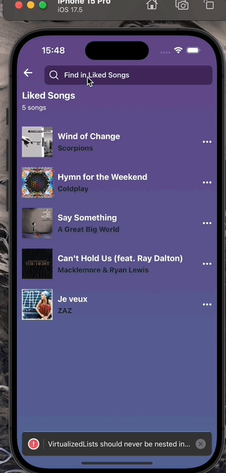

# Spotify Klonu Mobil Uygulaması

Bu proje, React Native kullanarak geliştirilmiş bir Spotify klonu mobil uygulamasıdır. Uygulama, Spotify API'sini kullanarak popüler albümleri, sanatçıları ve kullanıcı profillerini gösterir. Kullanıcılar ayrıca şarkı bilgilerini görüntüleyebilir ve favori şarkılarını dinleyebilir.

## Özellikler

- **Popüler Albümler ve Sanatçılar**: Türkiye'de popüler olan albümler ve sanatçılar listelenir.
- **Kullanıcı Profili**: Kullanıcı profil bilgileri ve takipçi sayıları gösterilir.
- **Albüm ve Şarkı Bilgileri**: Albüm detayları ve şarkı bilgileri görüntülenebilir.
- **Arama**: Kullanıcılar, şarkıları arayabilir ve sonuçları listeleyebilir.
- **Müzik Çalma**: Kullanıcılar, favori şarkılarını dinleyebilir ve müzik çalma kontrollerine erişebilir.

## Kullanılan Teknolojiler

- **React Native**: Mobil uygulama geliştirme için kullanıldı.
- **React Navigation**: Uygulama içi gezinme için kullanıldı.
- **Axios**: API isteklerini yönetmek için kullanıldı.
- **Context API**: Uygulama genelinde durum yönetimi için kullanıldı.
- **Linear Gradient**: Gradient arka plan efektleri için kullanıldı.
- **React Native Vector Icons**: Uygulama ikonları için kullanıldı.
- **react-native-track-player**: Müzik çalma özelliği için kullanıldı.

## API Kullanımı

Bu proje, Spotify ve Shazam API'lerini kullanmaktadır. API anahtarlarınızı ilgili dosyalarda yapılandırmayı unutmayın.

## Ekran Görüntüleri

